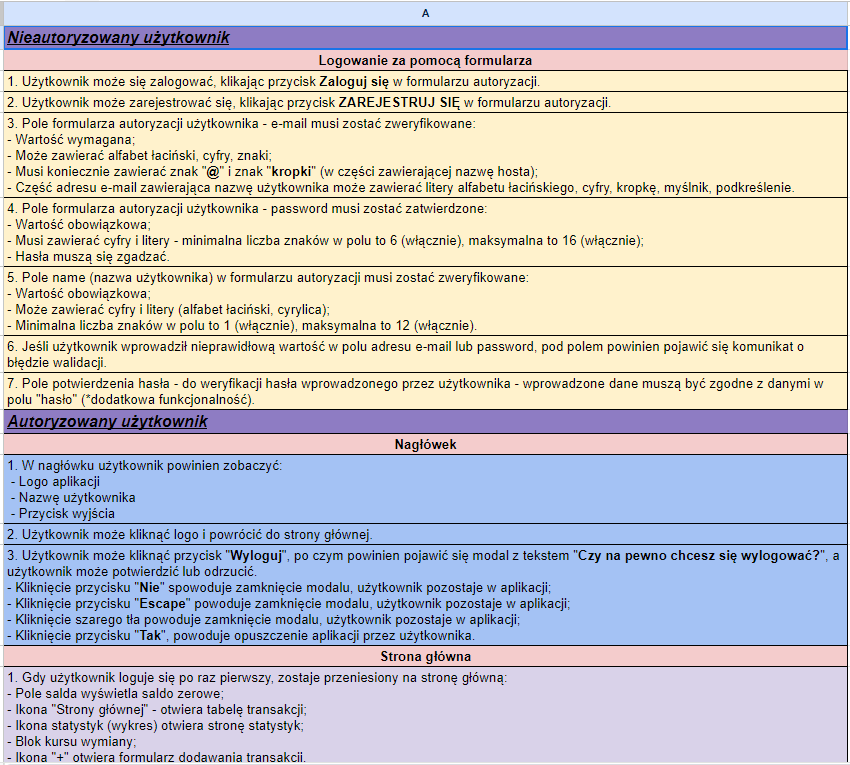
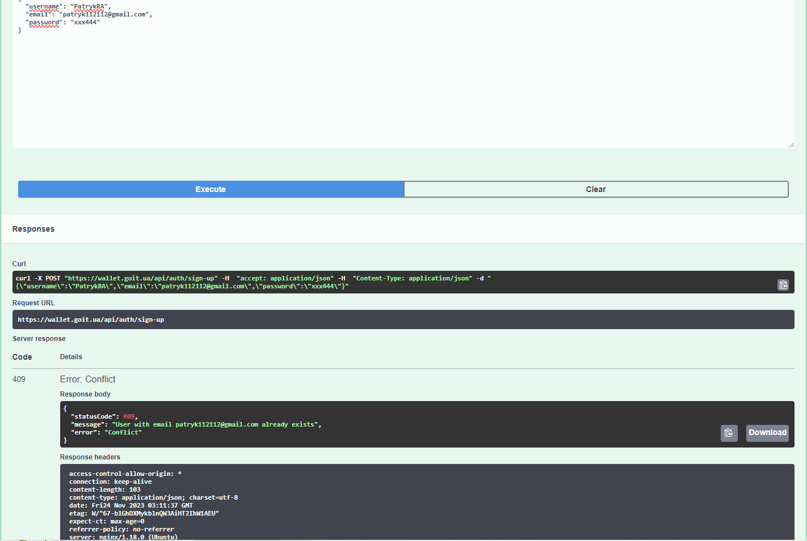
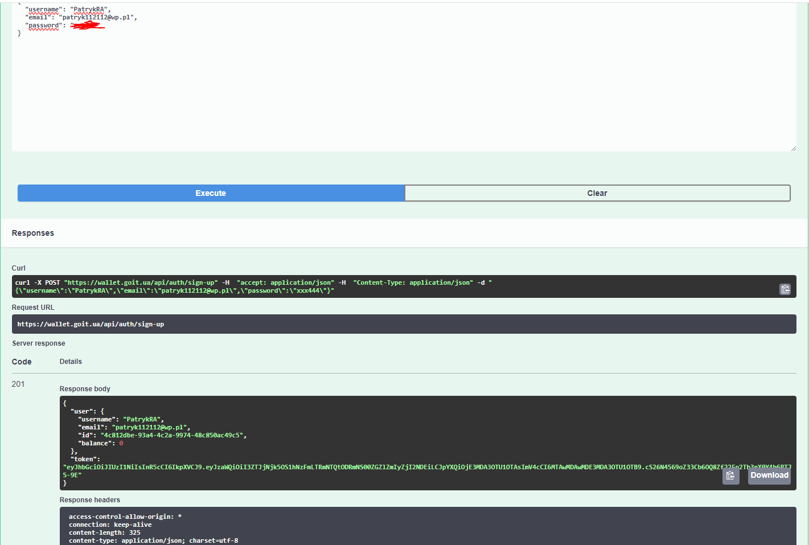
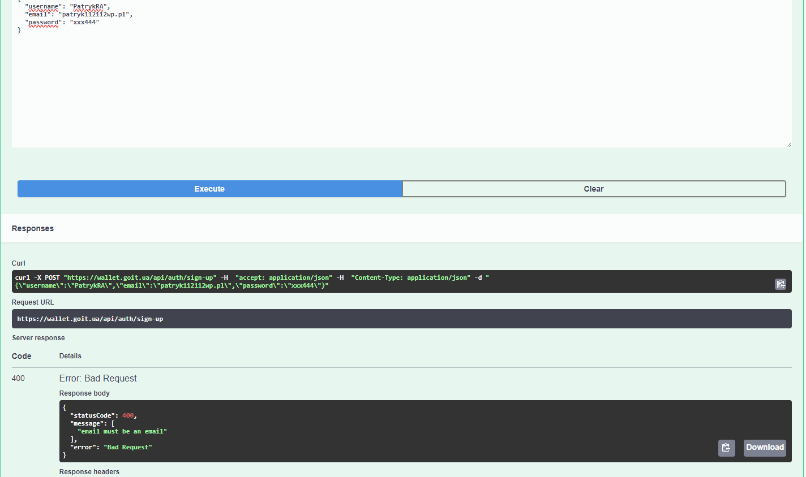
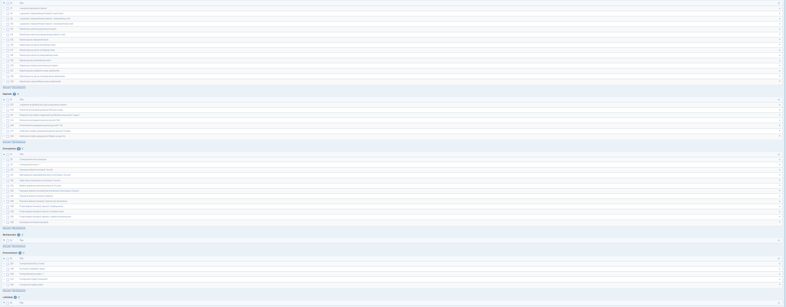
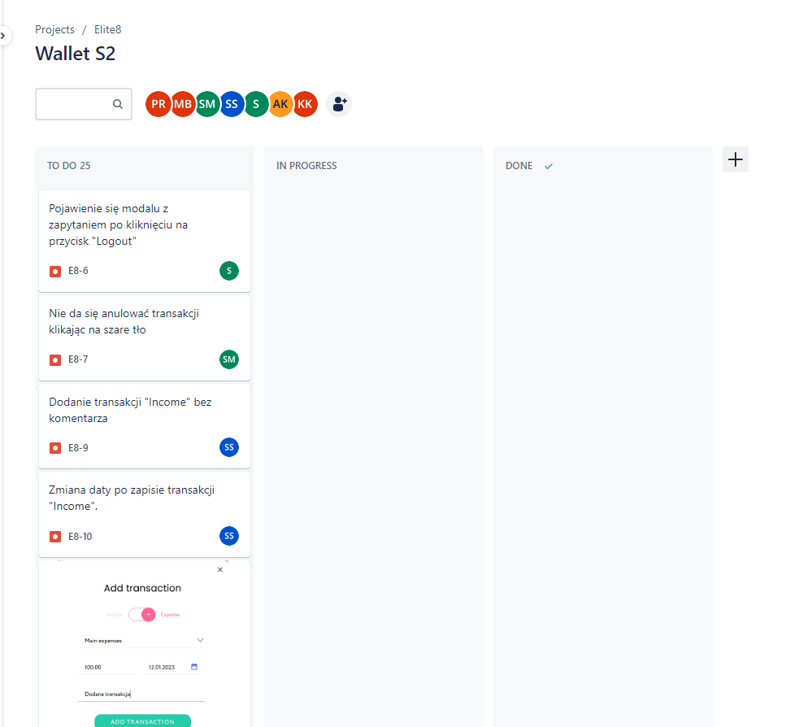
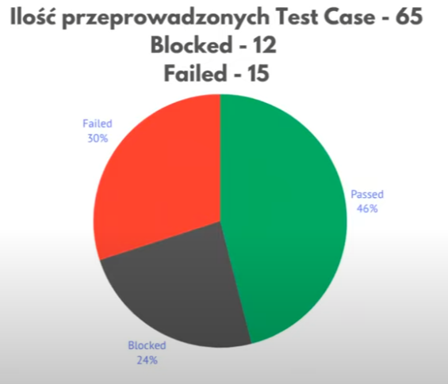

<h1 align="center">💲 PROJECT WALLET 💲</h1>
 
<h2>🔎 Information about the application</h2>
<tt>The initial stage of the project required a full understanding of the application and defining its key functions and goals.</tt>
 
<a> Main functions of the allpication:</a>
<ul>
  <li>records the income for the period</li>
  <li>records the expenses for the period</li>
  <li>household budget imaging</li>
  <li>overview of income and expenses</li>
  <li>creation of diagrams describing the current situation of the household budget</li>
</ul>
 
<h2> ⚙ Testing activities</h2>
<a>Test preparation:</a>
<ol>
  <li><b>SPECIFICATION OVERVIEW:</b> I started by reviewing the application specifications. Already at this stage there were many inaccuracies and ambiguities. The presence of a tester at the initial stage of creating specifications, would help minimize the risk of similar errors.</li>
  <li><b>CREATION OF TEST CASES:</b>Based on the requirements, and the experience gathered during the course, I started creating test cases.</li>
</ol>
 
<a>Execution of tests</a>
 
<ol>
  <li><b>EXECUTION OF TEST CASES:</b>I conducted tests of the app on both a personal computer and a smartphone. When testing on the smartphone, I paid particular attention to device-specific features, such as the responsiveness of the screen when rotating the device or the app's behavior when receiving a phone call</li>
  <li><b>API TESTING:</b>I performed API tests using the tool "Swagger" (examples below)</li>
  <li><b>CREATING BUG REPORTS:</b>I collected and documented the bugs I found, creating reports with detailed information about each bug.</li>
</ol>
 
<h2> 🧩 Examples</h2>
<a>Part of the application specification document:</a>

 
<a>Swagger - API</a>
<ol>
  <li>Attempting to register using an existing password - Test pass: code 409 confirms working of the function, the application detected that the specified email address already exists, and did not allow the creation of an account. </li>
  <li>Attempting to login using an existing password - Test pass: code 201 confirms the working of the function, by providing correct, existing data managed to log into the application </li>
  <li>Attempting to register using an invalid email address - Test pass: code 400 confirms working of the function, the application detected that the  email address is incorrect, and did not allow the creation of an account.</li>
</ol>
 
<tt>Of course, there were many more tests in swagger, but I didn't want the presentation to be too long. I hope that these few examples are sufficient, in confirmation of my skills.😁 </tt>
 
<a>Test cases in Testrail:</a>
 
<a>a general view of one of the test suites</a>

 
<a>some of test suites with stats</a>

 
<tt>I did not give single test cases here, you can find such on my portfolio. it was a project of several people, so we agreed that we would write all documents in Polish, since not everyone in the project felt comfortable enough with English</tt>
<a>Bug reports in Jira</a>

<tt>same case as above, more examples are on my portfolio</tt>
<h2>🗂 Summary of tests</h2>
<a>percentage of passed test cases:</a>

<a>Critical bugs:</a>
<ol>
  <li>No possibility to create a password containing special characters</li>
  <li>No e-mail address confirmation function</li>
  <li>The ability to create a username consisting only of a "space" character</li>
  <li>Lack of any possibility to sort transactions</li>
  <li>Incorrectly designed application logic as to currency exchange</li>
</ol>
<a>Suggestions on what to improve:</a>
<ol>
  <li>adding the possibility to enter a longer password containing special characters</li>
  <li>Adding the function of having to confirm the e-mail address at registration</li>
  <li>Adding the ability to sort and filter transactions</li>
  <li>improving the logic of currency exchange</li>
</ol>
 
<a>Summary: After thorough testing of the app, I conclude that there are several important reasons why the app is not ready for release. Analysis of the tests showed that only 46% of the 65 test cases were successful, which is a decidedly low test success rate. This result raises concerns about the performance and quality of the application itself.</a>
 
<a>In addition, key issues with the application's security level are dangerous to potential users. The lack of confirmation via email and the inability to enter a strong password are significant security gaps, putting user data at risk of unauthorized access.</a>
 
<a>In addition, the lack of sorting functionality makes the application interface unreadable and uncomfortable for the user. This lack of functionality reduces the convenience of the application, which can lead to frustration and impair the user experience.</a>
<a>Due to the above problems, I strongly recommend not releasing the app in its current state. It is necessary to take corrective measures, such as improving the success rate of tests, strengthening the level of security, and introducing sorting functions to ensure that the app is of sufficient quality and security for users.</a>
