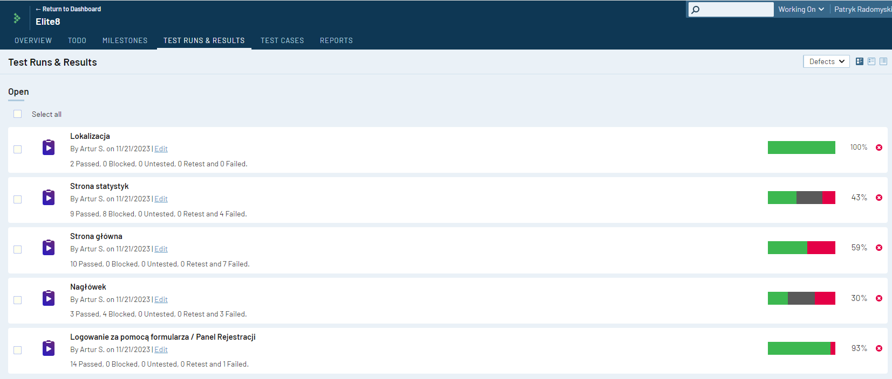

<h1 align="center">💲 PROJECT WALLET 💲</h1>
 
<h2>🔎 Information about the application</h2>
<tt>The initial stage of the project required a full understanding of the application and defining its key functions and goals.</tt>
 
<a> Main functions of the allpication:</a>
<ul>
  <li>records the income for the period</li>
  <li>records the expenses for the period</li>
  <li>household budget imaging</li>
  <li>overview of income and expenses</li>
  <li>creation of diagrams describing the current situation of the household budget</li>
</ul>
 
<h2> ⚙ Testing activities</h2>
<a>Test preparation:</a>
<ol>
  <li><b>SPECIFICATION OVERVIEW:</b> I started by reviewing the application specifications. Already at this stage there were many inaccuracies and ambiguities. The presence of a tester at the initial stage of creating specifications, would help minimize the risk of similar errors.</li>
  <li><b>CREATION OF TEST CASES:</b>Based on the requirements, and the experience gathered during the course, I started creating test cases.</li>
</ol>
 
<a>Execution of tests</a>
 
<ol>
  <li><b>EXECUTION OF TEST CASES:</b>I conducted tests of the app on both a personal computer and a smartphone. When testing on the smartphone, I paid particular attention to device-specific features, such as the responsiveness of the screen when rotating the device or the app's behavior when receiving a phone call</li>
  <li><b>API TESTING:</b>I performed API tests using the tool "Swagger" (examples below)</li>
  <li><b>CREATING BUG REPORTS:</b>I collected and documented the bugs I found, creating reports with detailed information about each bug.</li>
</ol>
 
<h2> 🧩 Examples</h2>
<a>Part of the application specification document:</a>

 
<a>Swagger - API</a>
<ol>
  <li>Attempting to register using an existing password - Test pass: code 409 confirms working of the function, the application detected that the specified email address already exists, and did not allow the creation of an account. </li>
  <li>Attempting to login using an existing password - Test pass: code 201 confirms the working of the function, by providing correct, existing data managed to log into the application </li>
  <li>Attempting to register using an invalid email address - Test pass: code 400 confirms working of the function, the application detected that the  email address is incorrect, and did not allow the creation of an account.</li>
</ol>
 
<tt>Of course, there were many more tests in swagger, but I didn't want the presentation to be too long. I hope that these few examples are sufficient, in confirmation of my skills.😁 </tt>
 
<a>Test cases in Testrail:</a>
 
<a>a general view of one of the test suites</a>

 
<a>some of test suites with stats</a>

 
<tt>I did not give single test cases here, you can find such on my portfolio. it was a project of several people, so we agreed that we would write all documents in Polish, since not everyone in the project felt comfortable enough with English</tt>
<a>Bug reports in Jira</a>

<tt>same case as above, more examples are on my portfolio</tt>
<h2>🗂 Summary of tests</h2>
<a>percentage of passed test cases</a>

